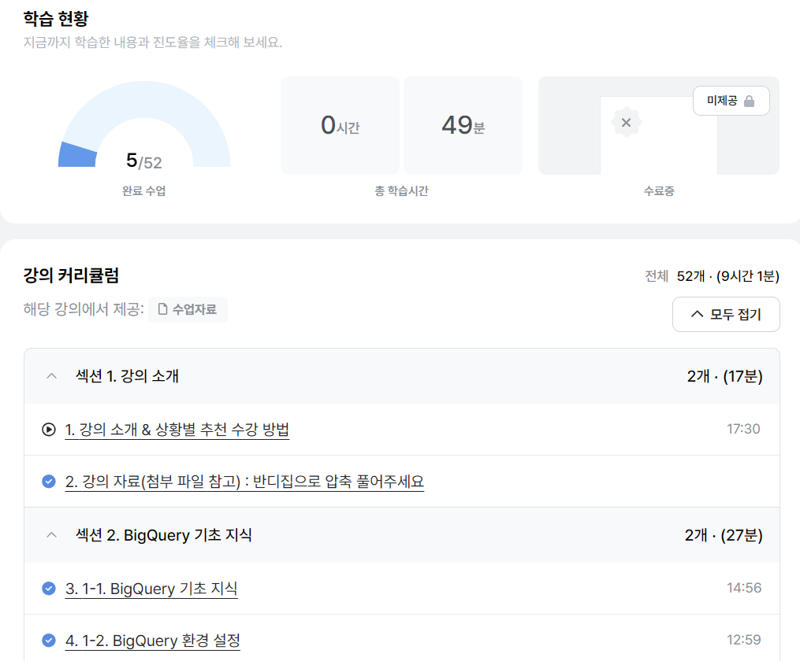

# SQL_BASIC 1주차 정규 과제 

📌SQL_BASIC 정규과제는 매주 정해진 분량의 `초보자를 위한 BigQuery(SQL) 입문` 강의를 듣고 간단한 문제를 풀면서 학습하는 것입니다. 이번주는 아래의 **SQL_Basic_1st_TIL**에 나열된 분량을 수강하고 `학습 목표`에 맞게 공부하시면 됩니다.

**1주차 과제**에서는 수강한 내용을 모두 요약 정리하기보다는, **SQL이 왜 필요한지에 대해 배우고 느낀 점, 그리고 강의를 듣고 본인이 원하는 목표를 중심으로 작성**하여 과제 업로드 시트에 깃허브 링크를 스프레드시트 'SQL' 시트에 붙여서 넣어주세요. 

**👀(수행 인증샷은 필수입니다.)** 

## SQL_BASIC_1st_TIL

### 섹션 2. BigQuery 기초 지식

### 1-1. BigQuery 기초 지식

### 1-2. BigQuery 환경 설정

## 섹션 3. 데이터 탐색 - 조건, 추출, 요약

### 2-1. 데이터 활용 Overview 

### 2-2. 저장된 데이터 확인하기

## 🏁 강의 수강 (Study Schedule)

| 주차  | 공부 범위              | 완료 여부 |
| ----- | ---------------------- | --------- |
| 1주차 | 섹션 **1-1** ~ **2-2** | ✅         |
| 2주차 | 섹션 **2-3** ~ **2-5** | 🍽️         |
| 3주차 | 섹션 **2-6** ~ **3-3** | 🍽️         |
| 4주차 | 섹션 **3-4** ~ **4-4** | 🍽️         |
| 5주차 | 섹션 **4-4** ~ **4-9** | 🍽️         |
| 6주차 | 섹션 **5-1** ~ **5-7** | 🍽️         |
| 7주차 | 섹션 **6-1** ~ **6-6** | 🍽️         |

 

<!-- 여기까진 그대로 둬 주세요-->

---

# 1️⃣ 개념정리 
<!-- 강의 수강 이후에 아래의 학습 목표에 맞게 개념을 자유롭게 정리해주세요.-->
## 1-1. BigQuery 기본지식

~~~
✅ 학습 목표 :
* 데이터 관련 기초 지식(OLTP, SQL, Row, Column, 저장 형태 등)을 설명할 수 있다. 
* BigQuery 관련 기초 지식에 대해서 파악할 수 있다. 
~~~

~~~
* OLTP
Online Transaction Processing, '거래'를 하기 위해 사용되는 데이터베이스 

* SQR
DB에서 데이터를 가지고 올 때 사용하는 프로그래밍 언어 
"SQR을 짠다" = "쿼리문을 작성한다"

* Row
행, 가로, "Row 1개 = 데이터 1개"

* Column
열, 세로, 각 데이터의 특정 속성 값

* 저장 형태
데이터는 데이터베이스 안의 테이블에 엑셀 스프레드시트와 유사한 모양으로 저장됨
~~~
~~~
* BigQuery
구글이 만든, 서버 관리 없이도 초대용량 데이터를 SQR로 빠르게 분석할 수 있는 클라우드 기반 데이터 웨어하우스(DWH)
상대적으로 쉽고, 빠르며, Firebase·Google Analytics4 데이터를 쉽게 추출 가능하고, 구글에서 인프라를 관리한다는 특징이 있음.

* (참고)DWH
여러 출처의 데이터를 분석하기 좋은 형태로 변환·통합해서 저장해 둔 시스템 

* Data < Table < Dataset < Project
~~~
## 2-1. 데이터 활용 Overview

~~~
✅ 학습 목표 :
* 데이터를 활용하는 과정을 설명할 수 있다.
* 데이터를 탐색하는 과정으로 조건과 추출, 요약을 할 수 있다. 
~~~

~~~
* (1)문제 정의 → (2)목표 설정 → (3)데이터 탐색 → (4)데이터 결과 검증 → (5)피드백/활용 

* 데이터 탐색과 데이터 결과 검증 단계에서 SQR을 활용함. 

* 데이터 활용 과정은 비가역적(one-way) 과정이 아니라 순환적(iterative)·반복적(repetitive) 과정

* 데이터 탐색 단계에서 조건, 추출, 변환, 요약 등이 활용됨 

* 조건 : "필터링", 원하는 행만 고르는 것 
  추출 : "컬럼 선택", 원하는 변수만 고르는 것
  변환 : "값 가공", 새로운 형태로 바꾸는 것 
  요약 : "집계", 통계적으로 압축하는 것
~~~

## 2-2. 저장된 데이터 활용하기

~~~
✅ 학습 목표 :
* 데이터가 저장되는 형태를 알고 저장된 데이터를 활용할 수 있다. 
~~~

~~~
* 쿼리를 작성하기 이전에, 데이터를 제대로 확인하고 이해하는 습관을 가질 필요가 있음. 

* ERD(Entity Relationship Diagram)
데이터가 저장된 대략적인 형태를 그려놓은 도식, 이를 통해 내가 원하는 데이터가 어디에 있고 어떤 의미를 지니고 있는지 확인할 수 있음.

* ERD가 없다면, 데이터·컬럼·연결성·컬럼 의미 등을 스프레드시트나 문서로 따로 정리해두면 좋음. 
~~~

---
# 2️⃣ 학습 인증란

 
 

---

# 3️⃣ 확인문제

## 문제 1

> **🧚Q. 포켓몬 게임이나 이커머스 산업과 같이 다양한 산업에서는 각기 다른 데이터가 존재합니다. 다음 중 하나의 산업을 선택하고, 해당 산업에서 수집하고 활용될 수 있는 데이터 항목 (칼럼) 5가지를 자유롭게 상상하여 나열해보세요.**
>
> - 예시 산업 
>
> >  온라인 음식 배달 / 스마트 헬스 케어 / 중고 거래 앱 / 교육 플랫폼 등 

<!--현실과 데이터 분석의 연결 고리를 상상하고, 데이터를 저장하는 형태를 활용하는 문제입니다. -->

<!--학습한 개념을 활용하여 자유롭게 설명해 보세요. 구체적인 예시를 들어 설명하면 더욱 좋습니다.-->

~~~
교육 플랫폼 
* Student_ID : 교육 플랫폼 내에서 학생이 사용하는 ID
* Lecture_Name : 교육 플랫폼에서 수강할 수 있는 구체적인 강의 이름 
* Subject : 강의가 국어, 수학, 영어 등 어느 과목에 속하는지 
* Completion_Rate : 수강 신청 대비 완료한 사람의 비율 
* Dropout_Rate : 수강 과정을 끝내지 않고 중도에 포기한 학생의 비율 
~~~

## 문제 2

> **🧚Q. 이번 강의를 통해 SQL이 왜 필요하다고 느끼는지, SQL을 통해 본인이 어떤 것을 해내고 싶은지를 자유롭게 작성해보세요.**

~~~
방대한 데이터베이스에서 데이터를 직접 조회하고 가공하며 요약할 수 있는 언어로서 SQL의 중요성을 실감했다. 
SQL을 통해 데이터를 목적에 맞게 처리하고, 효율적으로 가공·분석할 수 있는 역량을 키우고 싶다. 
~~~

### 🎉 수고하셨습니다.

